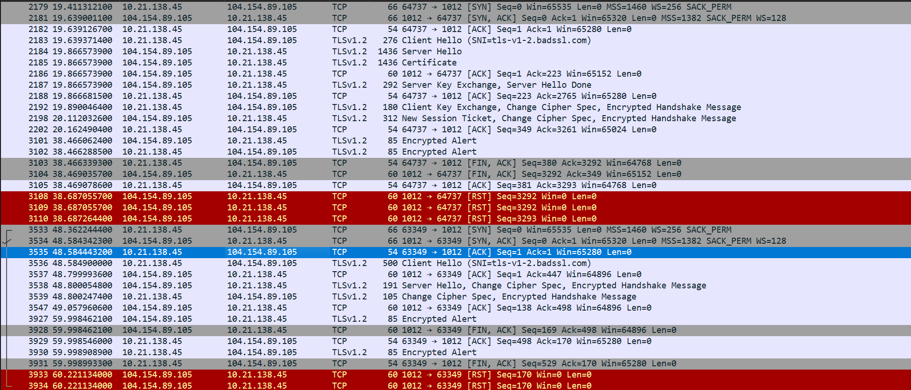
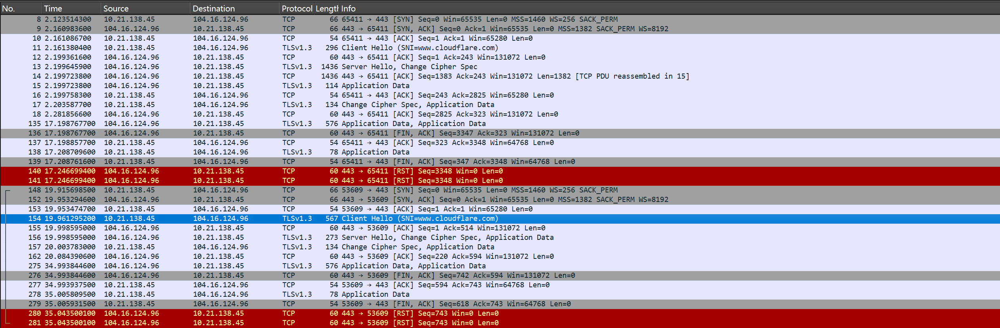
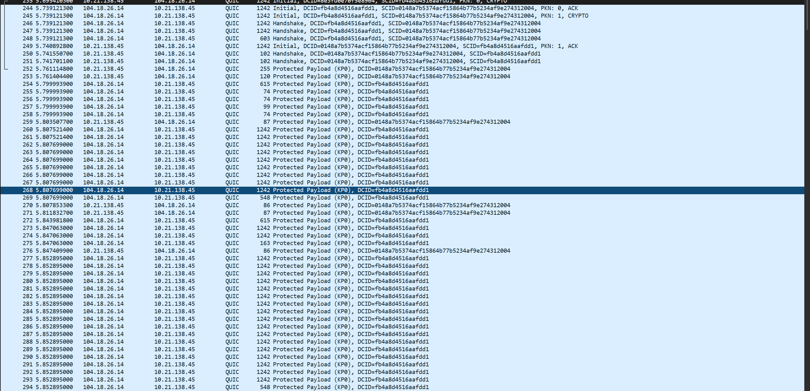
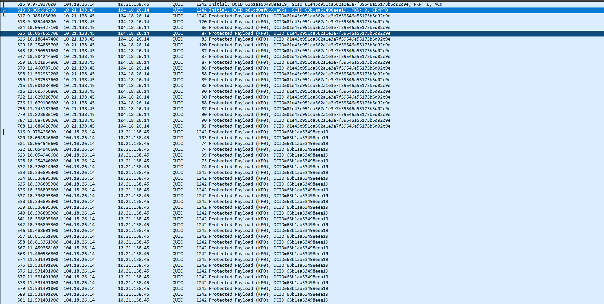

# 模块2：理论实践（安全协议基础）

## 1. 实验目的

1. 通过抓包分析 TLS 1.2 的完整握手过程，识别 Client Hello、Server Hello、Certificate、Server Key Exchange、Server Hello Done、Client Key Exchange、Change Cipher Spec、Finished 等关键报文，理解 TLS 1.2 建立安全连接的基本流程。
2. 通过抓包分析 TLS 1.2 的会话恢复过程，观察 Session ID 和 Session Ticket 等机制在连接复用中的作用，理解会话恢复如何减少握手开销、提高连接效率。
3. 通过抓包分析 TLS 1.3 的完整握手与会话恢复过程，识别 supported_versions、key_share、pre_shared_key 等关键扩展字段，理解 TLS 1.3 在握手流程和恢复机制上的改进。
4. 通过抓包分析 QUIC 协议中的握手与连接恢复过程，观察 TLS 1.3 握手消息在 QUIC CRYPTO 帧中的承载方式，理解 QUIC 在传输层和连接建立机制上的特点。
5. 对 TLS 1.2、TLS 1.3 和 QUIC 的握手流程、会话恢复机制、关键扩展字段以及连接建立效率进行对比分析，加深对现代安全传输协议演进过程的理解。

## 2. 实验环境与工具

### 2.1 实验环境

本实验在具备互联网访问条件的主机上进行，通过访问支持不同协议版本的网站服务器，采集 TLS 1.2、TLS 1.3 和 QUIC 的握手及会话恢复报文。实验过程中，客户端分别与支持 TLS 1.2、TLS 1.3 和 QUIC 的远程服务器建立连接，并使用抓包工具记录通信过程。

### 2.2 实验工具

1. Wireshark
  用于抓取并分析网络报文，观察 TLS 1.2、TLS 1.3 和 QUIC 的握手过程、关键字段及会话恢复特征。

2. OpenSSL
用于发起 TLS 1.2 和 TLS 1.3 连接，配合 `s_client` 命令完成完整握手与会话恢复测试，并输出握手消息内容。

3. Python HTTP/3 客户端脚本
用于发起 QUIC/HTTP3 连接，并结合会话票据文件完成 QUIC 新连接与恢复连接测试。

### 2.3 实验对象

1. TLS 1.2 测试服务器：`tls-v1-2.badssl.com:1012`
2. TLS 1.3 测试服务器：`www.cloudflare.com:443`
3. QUIC 测试服务器：`cloudflare-quic.com:443`

### 2.4 实验内容

1. 采集并分析 TLS 1.2 的完整握手报文和会话恢复报文。
2. 采集并分析 TLS 1.3 的完整握手报文和会话恢复报文。
3. 采集并分析 QUIC 的新连接报文和恢复连接报文。
4. 对 TLS 1.2、TLS 1.3 和 QUIC 在握手流程、恢复机制及关键扩展字段等方面进行对比分析。

## 3. 实验步骤

### 3.1 TLS 1.2 报文采集

首先使用 Wireshark 开始抓包，并设置显示过滤条件为：

```text
ip.addr == 104.154.89.105 and tcp.port == 1012
```

随后使用 OpenSSL 发起 TLS 1.2 完整握手，保存会话信息：

```sh
openssl s_client -connect tls-v1-2.badssl.com:1012 -servername tls-v1-2.badssl.com -tls1_2 -sess_out tls12_sess.pem -msg
```

完成一次完整连接后，再使用保存的会话信息发起 TLS 1.2 会话恢复连接：

```sh
openssl s_client -connect tls-v1-2.badssl.com:1012 -servername tls-v1-2.badssl.com -tls1_2 -sess_in tls12_sess.pem -msg
```

通过对两次连接的抓包结果进行对比，分析 TLS 1.2 在完整握手和会话恢复阶段的报文差异。

### 3.2 TLS 1.3 报文采集

使用 Wireshark 开始抓包，并设置显示过滤条件为：

```text
ip.addr == 104.16.124.96 and tcp.port == 443
```

首先使用 OpenSSL 发起 TLS 1.3 完整握手，并保存会话信息：

```sh
openssl s_client -connect www.cloudflare.com:443 -servername www.cloudflare.com -tls1_3 -sess_out tls13_sess.pem -msg
```

然后使用保存的会话信息发起 TLS 1.3 会话恢复链接

```sh
openssl s_client -connect www.cloudflare.com:443 -servername www.cloudflare.com -tls1_3 -sess_in tls13_sess.pem -msg
```

通过比较两次抓包结果，观察 TLS 1.3 中 `supported_versions、key_share、pre_shared_key` 等扩展字段的变化，并分析其会话恢复机制。

### 3.3 QUIC 报文采集

使用 Wireshark 开始抓包，并设置显示过滤条件为：

```text
ip.addr == 104.18.26.14 and udp.port == 443
```

如果之前的会话已经保存过票据，则需要首先删除已有票据文件

```sh
Remove-Item .\quic.ticket -ErrorAction SilentlyContinue
```

然后使用 HTTP/3 客户端发起 QUIC 新连接，并保存票据文件

```sh
python .\examples\http3_client.py -v -l quic_new.keys -s quic.ticket https://cloudflare-quic.com/
```

在第一次连接完成后，再次使用相同票据文件发起恢复链接

```sh
python .\examples\http3_client.py -v -l quic_resume.keys -s quic.ticket https://cloudflare-quic.com/
```

通过比较两次抓包结果，观察 QUIC 中 `Initial、Handshake、Protected Payload` 等报文特征，以及 `pre_shared_key、early_data` 等恢复连接相关字段。

### 3.4 抓包分析

在报文分析过程中，重点关注以下内容：

1. 握手报文的先后顺序；
2. `Client Hello` 和 `Server Hello` 中的关键字段；
3. 会话恢复时是否出现 `Session ID、session_ticket、pre_shared_key、early_data` 等标志性字段；
4. 完整握手与恢复连接在报文数量、报文类型和流程复杂度上的差异。

实验分析时，以 Wireshark 抓包结果为主，并结合命令输出信息，对不同协议的连接建立过程进行归纳和比较。

## 4. TLS 1.2 报文分析



### 4.1 TLS 1.2 完整握手分析

在 TLS 1.2 完整握手过程中，客户端首先向服务器发送 `Client Hello` 报文，协商支持的协议版本、加密套件和扩展字段；服务器随后返回 `Server Hello`，并继续发送证书、密钥交换参数以及握手结束标志，最后客户端完成密钥交换并与服务器进入加密通信阶段。

从抓包结果可以看出，TLS 1.2 完整握手的典型流程如下：

>Client Hello -> Server Hello -> Certificate -> Server Key Exchange -> Server Hello Done -> Client Key Exchange -> Change Cipher Spec -> Finished

#### 4.1.1 Client Hello 报文分析

在客户端发送的 Client Hello 报文中，可以观察到以下关键字段：

1. Version: TLS 1.2 (0x0303)
   表示客户端希望使用 TLS 1.2 建立连接。

2. Session ID Length: 0
   说明这是一次新的 TLS 会话，而不是基于已有会话状态进行恢复。

3. Cipher Suites
   客户端给出了多个可选加密套件，供服务器从中选择双方都支持的方案。

4. 关键扩展字段
   包括 server_name、supported_groups、ec_point_formats、session_ticket、signature_algorithms 等。这些扩展用于指示目标主机名、支持的椭圆曲线参数、签名算法以及是否支持会话票据等能力。

其中，`server_name` 扩展中包含目标主机名 `tls-v1-2.badssl.com`，说明客户端使用了 SNI 机制。（在握手开始阶段指明客户端要访问的目标主机名，使服务器能够在同一 IP 地址下为不同站点选择正确的证书。）

#### 4.1.2 Server Hello 报文分析

服务器返回的 `Server Hello` 报文中，可以观察到以下关键字段：

1. Version: TLS 1.2 (0x0303)
   表示服务器接受使用 TLS 1.2 版本进行通信。

2. Session ID Length: 0
   说明本次握手为新建会话，尚未复用已有会话。

3. Cipher Suite: TLS_ECDHE_RSA_WITH_AES_256_GCM_SHA384 (0xc030)
   表明服务器最终选择了基于 ECDHE 密钥交换、RSA 证书认证和 AES_256_GCM 对称加密的密码套件。

4. 扩展字段
   服务器返回了 renegotiation_info、ec_point_formats 和 session_ticket 等扩展字段，表明其支持安全重协商、椭圆曲线参数协商以及后续会话票据机制。

#### 4.1.3 完整握手特征分析

TLS 1.2 完整握手的核心特征在于服务器会显式发送完整的认证与密钥交换相关报文，包括：

1. Certificate
   用于向客户端提供服务器证书，证明服务器身份。
2. Server Key Exchange
   用于传递临时密钥交换参数，支持后续生成会话密钥。
3. Server Hello Done
   表示服务器端的握手初始阶段结束，等待客户端继续发送后续握手消息。

随后客户端发送 `Client Key Exchange`，并通过 `Change Cipher Spec` 与 `Finished` 报文通知服务器后续通信将进入加密状态。服务器完成对应响应后，TLS 安全连接建立成功。

因此，可以将本次连接判定为 TLS 1.2 的完整握手，而不是会话恢复。其主要依据在于：

1. `Client Hello` 中 `Session ID Length` 为 0；
2. 报文中出现了 `Certificate、Server Key Exchange` 和 `Server Hello Done`；
3. 握手过程完整执行了证书认证和密钥交换阶段。

#### 4.1.4 小结

TLS 1.2 完整握手流程较长，报文数量较多，需要完成服务器身份认证、密钥协商和加密参数确认等多个步骤，因此连接建立开销相对较大。但该过程能够在初始连接时为后续安全通信建立完整的信任基础和会话状态。

### 4.2 TLS 1.2 会话恢复分析

在完成一次 TLS 1.2 完整握手后，客户端和服务器已经建立了可复用的会话状态。再次建立连接时，如果双方支持会话恢复机制，就可以省略证书发送和完整密钥交换等步骤，从而减少握手开销，提高连接建立效率。

从抓包结果可以看出，TLS 1.2 会话恢复的典型流程如下：

> Client Hello -> Server Hello -> Change Cipher Spec -> Encrypted Handshake Message

与完整握手相比，会话恢复阶段的握手流程明显缩短，服务器不再发送 Certificate、Server Key Exchange 和 Server Hello Done 等报文。

#### 4.2.1 Client Hello 报文分析

在会话恢复阶段，客户端发送的 Client Hello 报文具有以下特征：

1. Version: TLS 1.2 (0x0303)
   说明客户端仍然使用 TLS 1.2 发起连接。
2. Session ID Length: 32
   说明客户端在本次握手中携带了之前建立连接时获得的会话标识，用于请求恢复已有会话。
3. Session ID 字段非空
   抓包中可以看到具体的 `Session ID` 值，这表明客户端尝试复用先前会话状态。
4. session_ticket 扩展中包含具体内容
   与完整握手阶段不同，此时 `session_ticket` 扩展中已经携带票据数据，说明客户端同时使用会话票据机制请求服务器恢复已有会话。
5. 其他字段
   如 `server_name、supported_groups、signature_algorithms` 等扩展仍然存在，用于维持正常的能力协商。

#### 4.2.2 Server Hello 报文分析

服务器返回的 `Server Hello` 报文也体现出恢复连接的特点：

1. Version: TLS 1.2 (0x0303)
   说明服务器同意继续使用 TLS 1.2。
2. Session ID Length: 32
   说明服务器接受了客户端提交的会话标识，并继续使用该会话状态。
3. Session ID 与客户端一致
   这表明服务器成功识别并恢复了之前建立的 TLS 会话。
4. Cipher Suite: TLS_ECDHE_RSA_WITH_AES_256_GCM_SHA384 (0xc030)
   说明恢复连接时继续使用与原会话兼容的加密套件。
5. 扩展字段数量减少
   抓包中服务器返回的扩展字段较少，表明此时不再需要进行完整的能力协商和参数分发。

#### 4.2.3 会话恢复特征分析

TLS 1.2 会话恢复最明显的特点是握手报文数量减少、流程简化。与完整握手相比，本次恢复连接中：

1. 没有出现 Certificate 报文；
2. 没有出现 Server Key Exchange 报文；
3. 没有出现 Server Hello Done 报文；
4. Server Hello 之后很快进入 Change Cipher Spec 和加密握手消息阶段。

这说明服务器没有重新执行完整的身份认证和密钥交换过程，而是直接复用了之前保存的会话状态。

因此，可以将本次连接判定为 TLS 1.2 的会话恢复。其主要依据包括：

1. Client Hello 中出现了非空的 Session ID；
2. session_ticket 扩展中携带了票据数据；
3. 服务器返回相同的 Session ID；
4. 握手过程中未再出现完整握手所需的证书和密钥交换报文。

#### 4.2.4 小结

TLS 1.2 会话恢复通过复用已有会话状态，避免了重新进行完整的证书认证和密钥交换过程，从而显著减少了握手报文数量，缩短了连接建立时间。这说明会话恢复机制能够有效降低 TLS 连接的性能开销，提高重复连接场景下的通信效率。

## 5. TLS 1.3 报文分析



### 5.1 TLS 1.3 完整握手分析

与 TLS 1.2 相比，TLS 1.3 对握手流程进行了明显简化，删除了部分旧版本中的中间握手报文，并将更多握手内容放入加密阶段传输，从而减少了连接建立时的时延和报文开销。

从抓包结果可以看出，TLS 1.3 完整握手的典型流程如下：

> Client Hello -> Server Hello -> Change Cipher Spec -> Application Data

需要说明的是，抓包结果中在 Server Hello 之后很快出现 Change Cipher Spec 和 Application Data，并不表示后续没有握手过程，而是说明 TLS 1.3 中后续很多握手消息已经进入加密传输阶段，无法像 TLS 1.2 那样直接看到完整的明文握手细节。

#### 5.1.1 Client Hello 报文分析

在 TLS 1.3 完整握手中，客户端发送的 Client Hello 报文包含以下关键字段：

1. Version: TLS 1.2 (0x0303)
   虽然抓包中该字段显示为 TLS 1.2，但这只是兼容旧版本实现的 legacy_version 字段，真正的协议版本需要通过扩展字段判断。
2. supported_cersions: TLS 1.3 (0X0304)
   该扩展明确表明客户端希望协商使用 TLS 1.3，这也是判断本次握手属于 TLS 1.3 的关键依据。
3. Session ID Length: 32
   客户端在 TLS 1.3 中仍可携带会话标识，但其意义已不同于 TLS 1.2 中传统的会话恢复方式，不能仅凭此字段判断是否恢复连接。
4. Cipher Suites
   客户端给出了多个 TLS 1.3 支持的密码套件，如 TLS_AES_256_GCM_SHA384 等，供服务器协商选择。
5. key_share 扩展
   该扩展中包含客户端提供的密钥交换参数，例如 x25519，用于完成基于椭圆曲线的密钥协商。
6. psk_key_exchange_modes 扩展
   表示客户端支持使用 PSK 结合 (EC)DHE 的方式进行密钥建立，这为后续会话恢复提供了基础。
7. server_name 扩展
   用于指明目标主机名 www.cloudflare.com，使服务器能够根据域名选择对应证书。

#### 5.1.2 Server Hello 报文分析

服务器返回的 Server Hello 报文中，可以观察到以下内容：

1. supported_versions: TLS 1.3 (0x0304)
   说明服务器接受客户端提议，最终协商使用 TLS 1.3。
2. Cipher Suite: TLS_AES_256_GCM_SHA384 (0x1302)
   表示服务器选择了 TLS 1.3 密码套件 TLS_AES_256_GCM_SHA384。
3. key_share 扩展
   服务器返回其选定的密钥交换参数，例如 x25519，与客户端共同完成会话密钥协商。
4. Session ID
   服务器返回与客户端一致的 `Session ID`，用于兼容性处理，但在 TLS 1.3 中，会话恢复的核心机制已不再是 TLS 1.2 的 Session ID 复用方式。

#### 5.1.3 与 TLS 1.3 完整握手的区别

TLS 1.3 完整握手与 TLS 1.2 的主要区别体现在以下几个方面：

1. 不再出现 Certificate、Server Key Exchange、Server Hello Done 等明显分离的明文握手报文；
2. 通过 supported_versions 扩展显式协商 TLS 1.3；
3. 通过 key_share 扩展直接完成密钥交换参数协商；
4. 后续更多握手消息被加密封装，因此在抓包中通常较快进入 Application Data 阶段。

因此，可以将本次连接判定为 TLS 1.3 的完整握手，而不是会话恢复。主要依据包括：

1. Client Hello 中没有出现 pre_shared_key 扩展；
2. Server Hello 中也没有返回 pre_shared_key；
3. 抓包中可以看到正常的 TLS 1.3 版本协商和 key_share 密钥交换过程。

#### 5.1.4 小结

TLS 1.3 相比 TLS 1.2 明显简化了握手流程，减少了可见报文类型，并将更多握手阶段内容放入加密传输中。这种设计在保证安全性的同时降低了连接建立的时延，为后续的快速恢复连接机制提供了更好的基础。

### 5.2 TLS 1.3 会话恢复分析

在 TLS 1.3 中，会话恢复机制不再像 TLS 1.2 那样主要依赖 `Session ID` 或传统的 `Session Ticket` 直接复用旧会话状态，而是通过 `pre_shared_key`（PSK）机制恢复先前建立的安全上下文。因此，在抓包中判断 TLS 1.3 是否发生会话恢复，关键在于是否出现 `pre_shared_key` 扩展。

从抓包结果可以看出，TLS 1.3 会话恢复的典型流程如下：

> Client Hello(pre_shared_key) -> Server Hello(pre_shared_key) -> Change Cipher Spec -> Application Data

与 TLS 1.3 完整握手相比，会话恢复阶段最明显的区别在于客户端和服务器的握手消息中都出现了 pre_shared_key 扩展。

#### 5.2.1 Client Hello 报文分析

在 TLS 1.3 会话恢复过程中，客户端发送的 Client Hello 报文具有以下特点：

1. supported_versions: TLS 1.3 (0x0304)
   说明客户端仍希望协商使用 TLS 1.3。
2. key_share 扩展存在
   表示客户端仍然提供了密钥交换参数，这表明恢复连接仍然结合了新的密钥协商过程，而不是简单重复旧密钥。
3. psk_key_exchange_modes 扩展存在
   说明客户端支持基于 PSK 的密钥交换模式，为恢复连接提供能力协商基础。
4. pre_shared_key 扩展存在
   是判断 TLS 1.3 会话恢复最关键的字段，说明客户端在本次连接中提交了之前会话生成的 PSK 信息，用于请求服务器恢复连接。
5. Session ID 字段仍可能存在
   但在 TLS 1.3 中，该字段并不是判断会话恢复的核心依据，真正关键的是 pre_shared_key 扩展。

#### 5.2.2 Server Hello 报文分析

服务器返回的 Server Hello 报文同样体现出会话恢复的特征：

1. supported_versions: TLS 1.3 (0x0304)
   说明服务器同意继续使用 TLS 1.3。
2. Cipher Suite: TLS_AES_256_GCM_SHA384 (0x1302)
   说明服务器选择了与客户端兼容的 TLS 1.3 密码套件。
3. pre_shared_key 扩展存在
   这表明服务器接受了客户端提交的 PSK，并基于该信息恢复先前建立的会话上下文。
4. key_share 扩展仍然存在
   说明即使在恢复连接中，TLS 1.3 仍然通常结合新的密钥交换参数，以提升恢复连接的安全性。

#### 5.2.3 会话恢复特征分析

TLS 1.3 会话恢复与 TLS 1.2 最大的不同在于恢复机制本身。TLS 1.2 主要通过 `Session ID` 和 `Session Ticket` 来复用已有会话，而 TLS 1.3 则通过 `pre_shared_key` 实现恢复连接。

本次抓包中可以据此判定发生了 TLS 1.3 会话恢复，主要依据包括：

1. `Client Hello` 中出现了 `pre_shared_key` 扩展；
2. `Server Hello` 中也返回了 `pre_shared_key` 扩展；
3. 握手过程比完整握手更加紧凑，很快进入加密传输阶段；
4. 抓包中未出现需要重新执行完整身份协商的明显明文报文链路。
   
需要指出的是，TLS 1.3 恢复连接虽然复用了先前会话生成的 PSK 信息，但通常仍会结合新的 key_share 参数进行密钥协商，因此其安全性优于简单重复旧密钥的恢复方式。

#### 5.2.4 与 TLS 1.2 会话恢复的区别

TLS 1.3 会话恢复与 TLS 1.2 会话恢复相比，主要有以下差异：

1. TLS 1.2 主要依据 Session ID 和 session_ticket；
2. TLS 1.3 主要依据 pre_shared_key；
3. TLS 1.2 的恢复流程是对旧会话状态的复用，而 TLS 1.3 的恢复机制与 PSK 结合得更加紧密；
4. TLS 1.3 在恢复连接时通常仍保留新的密钥交换过程，因此整体安全设计更加现代化。

#### 5.2.5 小结

TLS 1.3 通过 `pre_shared_key` 机制实现会话恢复，使恢复连接的判定方式与 TLS 1.2 明显不同。抓包结果表明，TLS 1.3 在恢复连接时能够在较少报文开销下快速建立安全通信，同时保留新的密钥协商过程，从而在效率和安全性之间取得了更好的平衡。

## 6. QUIC 报文分析

### 6.1 QUIC 新连接分析



QUIC 与 TLS 1.2、TLS 1.3 最大的不同在于其传输层基础不再是 TCP，而是直接运行在 UDP 之上。同时，QUIC 将 TLS 1.3 的握手消息封装在自己的 `CRYPTO` 帧中完成密钥协商和安全连接建立，因此其握手过程既具有 TLS 1.3 的密码学特征，又具有 QUIC 自身的报文结构特征。

从抓包结果可以看出，QUIC 新连接的典型流程如下：

> Initial -> Handshake -> Protected Payload

其中，客户端首先发送 `QUIC Initial` 包，在其中携带 TLS 1.3 的 `Client Hello`；服务器随后返回对应握手信息，连接建立后进入受保护的数据传输阶段。

#### 6.1.1 QUIC Initial 报文分析

在新连接阶段，客户端发送的第一个 QUIC 报文为 Initial 包，其主要特征包括：

1. 使用 UDP 传输
   该连接使用 udp.port == 443，说明 QUIC 不依赖 TCP 三次握手，而是直接在 UDP 基础上建立连接。
2. Long Header
   报文头部显示为 QUIC 长首部格式，适用于连接建立初期的握手阶段。
3. Packet Type: Initial
   表明该报文属于 QUIC 初始握手报文。
4. Connection ID
   报文中包含源连接 ID 和目的连接 ID，用于标识 QUIC 连接。这是 QUIC 区别于传统 TCP 连接的重要特征之一。
5. CRYPTO 帧
   在 QUIC Initial 包中可以看到 CRYPTO 帧，说明 TLS 握手消息并不是作为独立 TLS Record 在 TCP 中传输，而是被封装到 QUIC 的帧结构中。

#### 6.1.2 Client Hello 报文分析

在 `CRYPTO` 帧内部，可以看到 TLS 1.3 的 `Client Hello`，其中包含以下关键字段：

1. supported_versions: TLS 1.3 (0x0304)
   说明 QUIC 使用的是 TLS 1.3 的握手机制。
2. key_share 扩展
   客户端提供多个密钥交换参数，例如 secp256r1、secp384r1、x25519、x448，用于与服务器协商密钥。
3. signature_algorithms 扩展
   说明客户端支持的签名算法集合，用于后续认证协商。
4. supported_groups 扩展
   表明客户端支持的椭圆曲线组。
5. psk_key_exchange_modes 扩展
   说明客户端支持基于 PSK 的密钥交换模式，为后续恢复连接提供基础。
6. server_name 扩展
   其中包含目标主机名 cloudflare-quic.com。
7. application_layer_protocol_negotiation 扩展
   用于协商上层应用协议，说明 QUIC 不仅建立安全传输，还需要协商具体的应用层协议，如 HTTP/3。
8. quic_transport_parameters 扩展
   这是 QUIC 相对于普通 TLS 1.3 的重要新增内容，用于协商 QUIC 连接参数，如最大空闲超时、最大数据量、最大流数量等。

#### 6.1.3 新连接特征分析

从抓包结果来看，本次 QUIC 连接可以判定为新连接，而不是恢复连接，主要依据如下：

1. `Client Hello` 中没有出现 `pre_shared_key` 扩展；
2. 报文中没有出现 `early_data` 扩展；
3. 握手从 `Initial` 包开始，随后经历正常的握手和受保护载荷传输阶段；

这说明客户端和服务器正在建立一个全新的 QUIC 安全连接，需要完成完整的 TLS 1.3 握手协商，并同时建立 QUIC 传输层参数。

#### 6.1.4 与 TLS 1.3 新建握手的关系

QUIC 新连接在密码学上沿用了 TLS 1.3 的核心机制，例如 `supported_versions`、`key_share`、`psk_key_exchange_modes` 等扩展都与 TLS 1.3 相同；但其承载方式不同，不再通过 TCP 中的 TLS Record 传输，而是通过 QUIC 的 CRYPTO 帧在 UDP 报文中完成握手。

因此，QUIC 可以看作是在 UDP 上实现的一种集成了 TLS 1.3 安全握手能力的现代传输协议。

#### 6.1.5 小结

QUIC 新连接同时体现了两个层面的特点：一方面，它继承了 TLS 1.3 的安全握手机制；另一方面，它通过 UDP、Connection ID 和 QUIC 传输参数等设计，实现了与 TCP + TLS 不同的连接建立方式。与 TLS 1.2 和 TLS 1.3 相比，QUIC 的握手过程更强调传输层与安全层的一体化设计。

### 6.2 QUIC 恢复连接分析



在 QUIC 中，恢复连接机制同样建立在 TLS 1.3 的 PSK 基础之上。当客户端已经保存了之前连接建立过程中获得的票据或恢复信息后，再次连接同一服务器时，就可以在新的 `Client Hello` 中携带 `pre_shared_key`，从而发起恢复连接。若同时出现 `early_data`，则说明客户端还具备提前发送早期数据的能力。

从抓包结果可以看出，QUIC 恢复连接的典型流程如下：

> Initial(pre_shared_key, early_data) -> 后续简化握手 -> Protected Payload

与 QUIC 新连接相比，恢复连接的 Initial 报文中握手信息更多，并明显出现了恢复连接相关扩展。

#### 6.2.1 QUIC Initial 报文分析

在恢复连接阶段，客户端发送的第一个 QUIC 报文仍然是 Initial 包，但其中包含了更多恢复连接相关内容：

1. 仍然使用 UDP 传输
   说明 QUIC 的恢复连接仍然基于 UDP，不需要像 TCP 那样重新进行三次握手。
2. Packet Type: Initial
   表示连接建立仍然从 QUIC 初始握手报文开始。
3. Connection ID 发生变化
   虽然是恢复连接，但新的 QUIC 连接通常仍会使用新的连接标识，因此恢复连接并不意味着简单复用原连接的所有外部标识。
4. CRYPTO 帧长度增加
   抓包中可以看到恢复连接时 `CRYPTO` 帧中携带的数据更多，反映出客户端在 `Client Hello` 中增加了恢复连接相关扩展。

#### 6.2.2 Client Hello 报文分析

在 `CRYPTO` 帧内部的 TLS 1.3 `Client Hello` 中，可以观察到以下关键恢复特征：

1. supported_versions: TLS 1.3 (0x0304)
   说明恢复连接仍然基于 TLS 1.3 机制完成。
2. key_share 扩展存在
   表明客户端依旧提供新的密钥交换参数。
3. quic_transport_parameters 扩展存在
   说明即使是恢复连接，QUIC 仍然需要协商连接级传输参数。
4. pre_shared_key 扩展存在
   这是判断 QUIC 恢复连接最重要的依据，说明客户端携带了之前连接中获得的 PSK 信息，请求服务器基于已有会话上下文恢复连接。
5. early_data 扩展存在
   该扩展表明客户端具备发送早期数据的能力，这也是 QUIC 恢复连接中比普通 TLS 连接更具代表性的特征之一。

#### 6.2.3 恢复连接特征分析

与 QUIC 新连接相比，本次抓包中的恢复连接具有以下明显特征：

1. Client Hello 中出现了 pre_shared_key 扩展；
2. Client Hello 中出现了 early_data 扩展；
3. 握手流程相较新连接更紧凑，后续过程趋于简化；
4. 报文重点从“完整能力协商”转向“基于既有状态的快速恢复”。

因此，可以将本次连接判定为 QUIC 的恢复连接。其主要依据在于：客户端在初始握手阶段就提交了先前连接中获得的 PSK 信息，并具备早期数据能力，这说明连接建立不再是完全从零开始，而是建立在已有安全上下文基础上的快速恢复。

#### 6.2.4 与 TLS 1.3 会话恢复的关系

QUIC 恢复连接与 TLS 1.3 会话恢复在密码学机制上是一致的，二者都依赖 pre_shared_key 实现快速恢复；但 QUIC 在此基础上进一步结合了自身的传输层设计，使恢复连接表现出以下特点：

1. 握手承载在 QUIC CRYPTO 帧中，而不是 TLS Record 中；
2. 通过 UDP 建立连接，无需 TCP 三次握手；
3. 可结合 early_data 更早进入应用数据传输阶段；
4. 仍需同时处理 QUIC 传输参数协商。

因此，QUIC 可以看作是在 TLS 1.3 会话恢复机制基础上，进一步优化了连接建立效率的协议实现。

#### 6.2.5 小结

QUIC 恢复连接的关键特征是 `pre_shared_key` 和 `early_data` 扩展的出现。前者说明客户端正在利用先前连接建立的安全上下文恢复连接，后者则反映出 QUIC 支持更快速的数据发送能力。与 TLS 1.2 和 TLS 1.3 相比，QUIC 在恢复连接场景下表现出更强的低时延特性和更紧密的传输层集成能力。

## 7. TLS 1.2, TLS 1.3 与 QUIC 对比分析

通过对 TLS 1.2、TLS 1.3 和 QUIC 的完整握手与恢复连接报文进行分析，可以发现三者在握手流程、恢复机制、报文可见性以及连接建立效率等方面存在明显差异。

### 7.1 握手流程对比

TLS 1.2 的完整握手流程较长，需要经历 `Client Hello`、`Server Hello`、`Certificate`、`Server Key Exchange`、`Server Hello Done`、`Client Key Exchange`、`Change Cipher Spec` 和 `Finished` 等多个阶段。服务器在握手过程中显式发送证书和密钥交换参数，因此抓包中可以观察到较完整的明文握手链路。

TLS 1.3 对握手流程进行了简化，不再像 TLS 1.2 那样单独出现 `Server Key Exchange` 和 `Server Hello Done` 等报文，而是通过 `supported_versions` 和 `key_share` 等扩展完成更紧凑的版本协商和密钥交换。抓包中在 `Server Hello` 之后很快进入加密阶段，因此可直接观察到的明文握手报文数量减少。

QUIC 在密码学机制上沿用 TLS 1.3，但其握手消息不通过 TCP 中的 TLS Record 传输，而是封装在 QUIC 的 `CRYPTO` 帧中，并通过 UDP 报文承载。QUIC 的握手除包含 TLS 1.3 常见扩展外，还需要额外协商 `quic_transport_parameters`，体现出其传输层与安全层一体化的特点。

### 7.2 会话恢复机制对比

TLS 1.2 的会话恢复主要依赖 `Session ID` 和 `session_ticket`。在恢复连接过程中，客户端通过在 `Client Hello` 中携带已有会话标识和票据，请求服务器复用先前建立的会话状态。其恢复成功的典型表现是握手流程明显缩短，且不再出现 `Certificate`、`Server Key Exchange` 和 `Server Hello Done` 等报文。

TLS 1.3 的会话恢复机制发生了明显变化，其核心依据不再是传统的 `Session ID`，而是 `pre_shared_key`。在恢复连接时，客户端与服务器通过 `pre_shared_key` 扩展完成恢复协商，同时通常仍结合新的 `key_share` 参数参与密钥协商，因此在效率提升的同时保留了更好的安全性。

QUIC 的恢复连接机制本质上与 TLS 1.3 一致，同样依赖 `pre_shared_key`。但由于 QUIC 自身建立在 UDP 之上，并支持 `early_data`，因此其恢复连接能够进一步减少时延，表现出更强的快速建立连接能力。

### 7.3 关键字段对比

TLS 1.2 分析时，最关键的恢复判据是 `Session ID` 和 `session_ticket`，而完整握手的重要标志则是 `Certificate`、`Server Key Exchange` 和 `Server Hello Done` 等报文的出现。

TLS 1.3 分析时，关键字段变为 `supported_versions`、`key_share` 和 `pre_shared_key`。其中，`supported_versions` 用于明确协商 TLS 1.3， `key_share` 用于完成密钥交换，`pre_shared_key` 则是判断恢复连接的核心依据。

QUIC 除了具有 TLS 1.3 的 `supported_versions`、`key_share` 和 `pre_shared_key` 外，还额外包含 `quic_transport_parameters`，用于协商 QUIC 层面的连接控制参数。同时，在恢复连接中还可观察到 `early_data`，这是 QUIC 快速恢复能力的重要体现。

### 7.4 连接建立效率对比

从连接建立效率看，TLS 1.2 的完整握手过程最长，报文数量最多，握手开销也最大。其会话恢复虽然能够减少部分握手步骤，但整体设计仍保留了较多旧版本特征。

TLS 1.3 通过简化握手流程、减少明文报文和引入 PSK 恢复机制，明显提升了连接建立效率。相比 TLS 1.2，其恢复连接更简洁，协议设计也更现代化。

QUIC 则在 TLS 1.3 的基础上进一步优化了连接建立过程。由于其运行在 UDP 之上，避免了 TCP 三次握手带来的额外时延，并支持 `early_data`，因此在重复连接和低时延场景下具有更明显的性能优势。

### 7.5 对比总结

综合来看，TLS 1.2、TLS 1.3 和 QUIC 体现了安全传输协议不断向高效率、低时延和更强安全性演进的过程。TLS 1.2 更适合用来理解传统 TLS 握手和会话恢复机制；TLS 1.3 在保持安全性的同时大幅简化了握手流程；QUIC 则进一步将 TLS 1.3 的安全机制与现代传输层设计结合起来，在握手效率和恢复连接能力方面表现更优。

| 对比项 | TLS 1.2 | TLS 1.3 | QUIC |
| - | - | - | - |
| 传输层 | TCP | TCP | UDP |
| 完整握手特征 | 报文多，流程完整可见 | 流程简化，后续握手加密 | TLS 1.3 握手封装在 CRYPTO 帧中 |
| 恢复机制 | Session ID / Session Ticket | pre_shared_key | pre_shared_key |
| 恢复连接特征 | session_ticket | supported_versions、key_share、pre_shared_key | quic_transport_parameters、early_data |
| 关键新增扩展 | session_ticket | supported_versions、key_share、pre_shared_key | quic_transport_parameters、early_data |
| 建连效率 | 较低 | 较高 | 最高 |

## 8. 实验结论

本实验通过对 TLS 1.2、TLS 1.3 和 QUIC 的完整握手及恢复连接过程进行抓包分析，比较了三种协议在握手流程、关键扩展字段和会话恢复机制上的差异。实验结果表明，TLS 1.2 的完整握手流程较长，能够在抓包中清晰观察到 `Certificate`、`Server Key Exchange` 和 `Server Hello Done` 等报文；其会话恢复主要依赖 `Session ID` 和 `session_ticket`，恢复后握手流程明显缩短。

相比之下，TLS 1.3 简化了握手流程，并通过 `supported_versions`、`key_share` 和 `pre_shared_key` 等扩展完成版本协商、密钥交换和会话恢复。其握手后半段更多采用加密传输，因此抓包中可直接观察到的明文握手报文减少，但连接建立效率更高，恢复机制也更加现代化。

QUIC 在密码学机制上沿用 TLS 1.3，同时将握手消息封装在 QUIC 的 `CRYPTO` 帧中，并运行于 UDP 之上。抓包结果显示，QUIC 不仅支持基于 `pre_shared_key` 的恢复连接，还可结合 `early_data` 实现更快速的数据发送，因此在低时延和高效率方面具有明显优势。

综合来看，TLS 1.2、TLS 1.3 和 QUIC 体现了安全传输协议从传统完整握手向低时延、高效率和更强恢复能力不断演进的发展趋势。通过本次实验，可以更深入地理解现代网络安全协议在设计思想和实现机制上的差异。